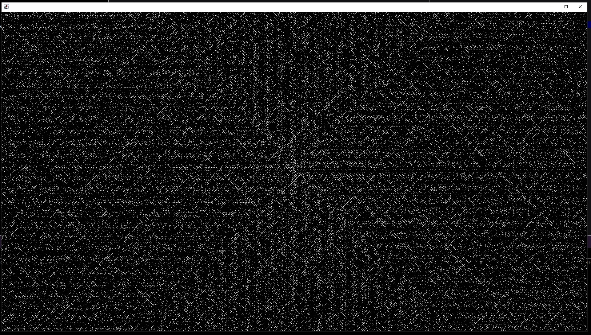

# The simple Ulam spiral generator

- Description:

The provided Java program generates Ulam Spirals, a visual representation of prime numbers arranged in a spiral pattern. The Ulam Spiral starts with the number 1 at the center, and each subsequent number is placed in a spiral pattern based on whether it is a prime number.

- Key Features:

1)Ulam Spiral Generation: The program creates an Ulam Spiral on a graphical interface using Java's AWT library.

2)Prime Number Detection: It utilizes a simple primality check to determine if a number is prime.

3)Dynamic Spiral Size: The spiral adjusts its size based on the dimensions provided, and the step amount is calculated dynamically.

4)File I/O: The prime numbers generated are saved to a binary file ("primes.bin"), and there's an option to print numbers from the file.

- How to Use:

Run the program, and a graphical window will appear displaying the Ulam Spiral of prime numbers.

The program automatically saves the prime numbers to a binary file named "primes.bin" upon completion.

Optionally, you can print the prime numbers from the file using the printNumbersFromFile method.

- Important Note:

The program uses a basic primality check, which may not be optimized for extremely large numbers. For larger applications, consider implementing a more sophisticated algorithm for primality testing.

The graphical window can be resized, and the spiral will adapt accordingly, repainting to fit the new dimensions.

- File Handling:

The prime numbers are saved to "primes.bin" using savePrimesToFile method.

To print numbers from the file, use the printNumbersFromFile method with the file path as an argument.

- Closing the Program:

Close the graphical window, and the program will exit gracefully.
